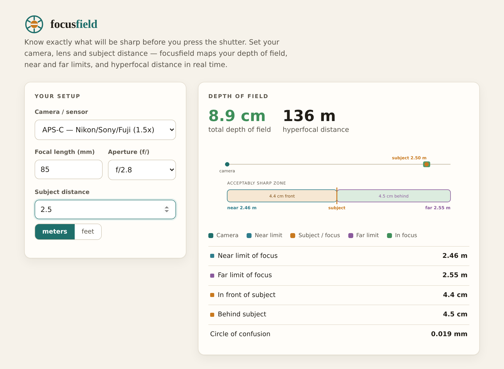

  

<h1 align="center">focusfield</h1>

<em>Know exactly what will be sharp before you press the shutter.</em>

  

## What it is

**focusfield** is a fast, offline depth-of-field and hyperfocal-distance calculator for photographers. Pick your camera, dial in a focal length, aperture and subject distance, and it instantly maps the acceptably-sharp zone — near limit, far limit, how much falls in front of and behind your subject, and the hyperfocal distance for that setup.

It runs as a single HTML page in your browser. No account, no upload, no network — open it and it works, on the trailhead or in the studio.

## Who it's for

- Portrait and wedding shooters checking how thin their depth of field really is wide open
- Landscape photographers hunting the hyperfocal distance for front-to-infinity sharpness
- Product, macro and studio shooters planning focus stacks
- Students and instructors who want to *see* how sensor size, aperture and distance trade off

## Features

- **Real depth-of-field math** — thin-lens near/far limits and hyperfocal distance from focal length, f-stop and a sensor-specific circle of confusion.
- **Six sensor presets** — full frame, Canon and Nikon/Sony/Fuji APS-C, Micro Four Thirds, 1-inch and medium format.
- **A visualization that reads instantly** — a true-scale strip from camera to subject, plus a zoomed "acceptably sharp zone" band that splits the depth in front of and behind your subject. Color-coded near, subject and far markers.
- **Meters or feet** — one tap to switch; the subject distance converts with you.
- **Smart edge cases** — tells you when your subject is at or beyond the hyperfocal distance (sharp to infinity), and flags near-macro distances where the model breaks down.
- **Accessible** — WCAG-AA contrast, keyboard-friendly inputs and visible focus states.

## How to use

1. Open `index.html` in any modern browser.
2. Choose your camera/sensor, then enter focal length, aperture and subject distance.
3. Read your depth of field, near/far limits and hyperfocal distance — they update as you type.

That's it. To host it, drop the folder on any static host; there's no build step.

## Files

| File | Purpose |
|------|---------|
| `index.html` | The entire app — markup, styles and logic in one file |
| `logo.svg` | Original aperture-ring mark |
| `screenshot.png` | Preview used above |

## Notes on accuracy

focusfield uses the standard thin-lens depth-of-field model with a circle of confusion scaled to each sensor format. Results match established DoF references to within rounding. Distances are measured from the sensor plane. As with any DoF tool, treat "acceptably sharp" as a guideline for viewing at normal sizes — pixel-peeping at 100% is always less forgiving.

## License

MIT — original code and artwork, free to use, modify and sell.
